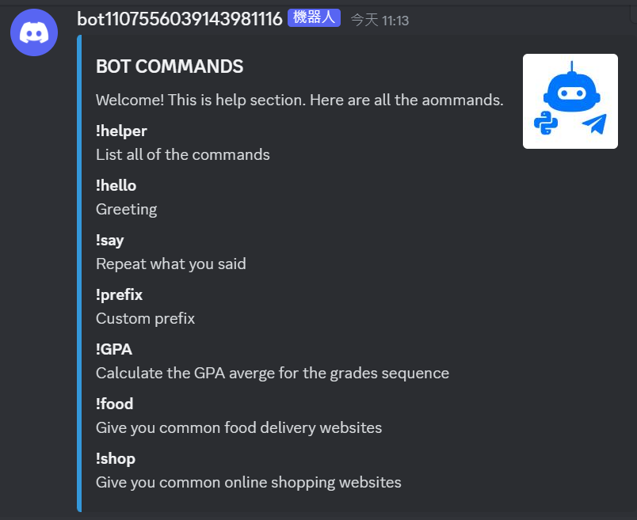

# BBC-discord bot

## Environment Setup

#### Exactly the same as TA's default

## File

#### Download
* git clone: https://github.com/Chloe60492/DC_BOT.git
* B08404023.zip

#### python file:

* `main.py`
* `basic_feature.py`
* `extra_feature.py`

## RUN & FUNCTION

### Excutate `main.py` file
#### if it suceeds then you will see `Bot is online!` and login message in your terminal. 

### Input the following commands in the dialog box

#### Basic features
* `!hello`
    * Input: `!hello`
    * Bot reply: 
        * The first greeting: `Hello {member.name}~`
        * Not the first greeting: `Hello {member.name}... This feels familiar.`
    * Example: 

* `!say`
    * Input: `!say "any word you want to say"`
    * Bot reply: repeat your words
    * Example:

* `!prefix`
    * Input: `!prefix "any punctuation"`
    * Bot reply:
        * `Command prefix has been set to "{new_prefix}"`
        * Then, we need to use new prefix to type all commands
    * Example: 
        

* `!GPA`
    * Input: `!GPA "grading sequence with space between two grade "`
    * Bot reply: Calculate the average of the grading sequece we provided
    * Example:
        

#### Extra features
* use `on_message` to monitor keywords and reply automatically
    * Input: any words including "thanks", "thank" or "thx"
    * Bot reply: 
        * randomly reply something like "You're welcome!"
        * react to our words with emoji🤗
    * Example:
        

* `!helper`
    * Input: `!helper`
    * Bot reply: show all commands of the bot and how they work with embed messages
    * Example:
        
        

* `!food`
    * Input:`!food`
    * Bot reply: provide two button link to two common food delivery websites
    * Example:
        

* `!shop`
    * Input:`!shop`
    * Bot reply: provide three button link to two common online shopping websites
    * Example:
        
